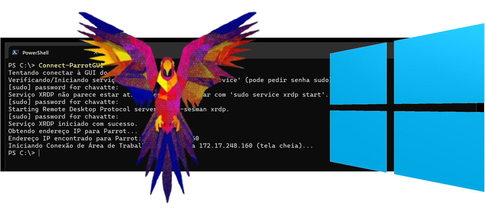

<pre style="font-size: 0.7rem;">

                              \\\\\\
                           \\\\\\\\\\\\
                          \\\\\\\\\\\\\\\
-------------,-|           |C>   // )\\\\|    .o88b. db   db  .d8b.  db    db  .d8b.  d888888b d888888b d88888b
           ,','|          /    || ,'/////|   d8P  Y8 88   88 d8' '8b 88    88 d8' '8b '~~88~~' '~~88~~' 88'  
---------,','  |         (,    ||   /////    8P      88ooo88 88ooo88 Y8    8P 88ooo88    88       88    88ooooo 
         ||    |          \\  ||||//''''|    8b      88~~~88 88~~~88 '8b  d8' 88~~~88    88       88    88~~~~~ 
         ||    |           |||||||     _|    Y8b  d8 88   88 88   88  '8bd8'  88   88    88       88    88.   
         ||    |______      ''''\____/ \      'Y88P' YP   YP YP   YP    YP    YP   YP    YP       YP    Y88888P
         ||    |     ,|         _/_____/ \
         ||  ,'    ,' |        /          |                 ___________________________________________
         ||,'    ,'   |       |         \  |              / \                                           \ 
_________|/    ,'     |      /           | |             |  |                                            | 
_____________,'      ,',_____|      |    | |              \ |      chavatte@duck.com                     | 
             |     ,','      |      |    | |                |                        chavatte.42web.io   | 
             |   ,','    ____|_____/    /  |                |    ________________________________________|___
             | ,','  __/ |             /   |                |  /                                            /
_____________|','   ///_/-------------/   |                 \_/____________________________________________/ 
              |===========,'                                                                                  
			  

</pre>



# Parrot OS Security com GUI no WSL2 (Windows 10/11) | Parrot OS Security with GUI on WSL2 (Windows 10/11)

## Resumo

Este guia detalha o processo de instalação do Parrot OS Security Edition no Subsistema Windows para Linux (WSL2), configurando o acesso à sua interface gráfica (GUI) via XRDP e fornecendo um script PowerShell para facilitar a conexão. O método foca na importação manual de um *rootfs*, garantindo flexibilidade e um atalho de conexão rápida.

## Abstract

This guide details the installation process of Parrot OS Security Edition on the Windows Subsystem for Linux (WSL2), configuring access to its graphical user interface (GUI) via XRDP, and providing a PowerShell script for easy connection. The method focuses on manually importing a *rootfs*, ensuring flexibility and a quick connection shortcut.

---

<details>
<summary>🇧🇷 Guia Completo (Português do Brasil)</summary>

## Visão Geral

O Parrot OS é uma distribuição GNU/Linux baseada em Debian, amplamente utilizada por profissionais de segurança e entusiastas de privacidade. O WSL2 permite executar um ambiente Linux completo e integrado ao Windows, oferecendo excelente desempenho. Este guia foca na importação manual de um *rootfs* do Parrot OS para WSL, garantindo flexibilidade na escolha da versão e local de instalação.

**Funcionalidades cobertas:**

* Configuração do WSL2 no Windows.
* Download e preparação de um *rootfs* do Parrot OS para WSL.
* Importação e configuração inicial do Parrot OS no WSL.
* Instalação e configuração de um ambiente de desktop (se não incluído no *rootfs*).
* Configuração do servidor XRDP para acesso remoto ao desktop.
* Criação de uma função PowerShell (`Connect-ParrotGUI`) para conexão rápida.

## Pré-requisitos

* Windows 10 (build 19041 ou superior) ou Windows 11 (64 bits), devidamente atualizado.
* Virtualização de Hardware (VT-x/AMD-V) habilitada na BIOS/UEFI do sistema.
* Privilégios de Administrador no Windows.
* Conexão estável com a Internet.
* (Recomendado) [Windows Terminal](https://aka.ms/terminal) instalado via Microsoft Store.

## Passo 1: Habilitando o WSL2 e Recursos de Virtualização

1. **Abrir PowerShell como Administrador:**
   Pesquise "PowerShell", clique com o botão direito em "Windows PowerShell" e selecione "Executar como administrador".
2. **Habilitar Funcionalidades Necessárias:**
   Execute os seguintes comandos:

   ```powershell
   dism.exe /online /enable-feature /featurename:Microsoft-Windows-Subsystem-Linux /all /norestart
   dism.exe /online /enable-feature /featurename:VirtualMachinePlatform /all /norestart
   ```
3. **Reiniciar o Windows:** Este passo é crucial.
4. **Atualizar Componentes do WSL (Incluindo Kernel):**
   Após reiniciar, abra o PowerShell (preferencialmente como Administrador) e execute:

   ```powershell
   wsl --update
   ```

   Este comando instalará a versão mais recente do kernel Linux e outros componentes do WSL.
5. **Definir WSL2 como Padrão:**

   ```powershell
   wsl --set-default-version 2
   ```

## Passo 2: Download e Preparação do RootFS do Parrot OS para WSL

1. **Obter o RootFS:**

   * **Recomendado:** Visite a [página oficial de downloads do Parrot OS](https://parrotsec.org/download/) ou o [repositório GitLab do projeto WSL do Parrot](https://gitlab.com/parrotsec/project/wsl) para encontrar a versão WSL mais recente. Procure por um link direto para um arquivo `.tar.gz` ou um `.zip` que o contenha.
   * **Alternativa (Usando um Link de Build Específico - Use com Cautela):** Links diretos para artefatos de *jobs* do GitLab (ex: `.../jobs/ID_DO_JOB/artifacts/download...`) podem expirar ou ser de versões desatualizadas. Prossiga com cautela se usar um desses.
2. **Extrair `install.tar.gz` (se necessário):**

   * Se você baixou um arquivo como `artifacts.zip`, extraia-o.
   * Navegue pela estrutura de pastas extraídas (ex: `Base_Builder/build/output.zip/build/` ou similar) até localizar o arquivo `install.tar.gz`.
   * Mova este arquivo `install.tar.gz` para um local de fácil acesso, por exemplo: `C:\Temp\ParrotWSL\install.tar.gz`.
3. **Criar Pasta de Instalação no Windows:**
   Crie um diretório onde os arquivos do Parrot OS serão armazenados.
   Exemplo: `C:\WSL_Distros\Parrot` (você pode escolher qualquer unidade/caminho).

## Passo 3: Importando e Configurando o Parrot OS no WSL

1. **Importar para o WSL:**
   Abra o PowerShell como Administrador e execute:

   ```powershell
   # Substitua os caminhos e o nome da distro conforme sua configuração
   wsl --import Parrot "C:\WSL_Distros\Parrot" "C:\Temp\ParrotWSL\install.tar.gz" --version 2
   ```

   *(`Parrot` é o nome sugerido para a distro no WSL. `C:\WSL_Distros\Parrot` é o diretório de instalação. `C:\Temp\ParrotWSL\install.tar.gz` é o rootfs baixado).*
2. **Configuração Inicial do Usuário:**

   * Inicie a nova distro (logará como `root`):
     ```powershell
     wsl -d Parrot
     ```
   * Dentro do terminal Parrot, crie seu usuário (substitua `seu_usuario_parrot`):
     ```bash
     adduser seu_usuario_parrot
     ```

     (Siga os prompts para senha e informações).
   * Adicione o usuário aos grupos necessários:
     ```bash
     usermod -aG sudo,adm,cdrom,dip,plugdev seu_usuario_parrot
     ```
   * Defina o usuário como padrão para login no WSL:
     ```bash
     echo -e "[user]\ndefault = seu_usuario_parrot" > /etc/wsl.conf
     ```
   * Saia da sessão `root`:
     ```bash
     exit
     ```
3. **Finalizar e Reiniciar a Distro:**
   No PowerShell:

   ```powershell
   wsl --terminate Parrot
   wsl -d Parrot
   ```

   Você deve logar como `seu_usuario_parrot`.
4. **Atualizar o Sistema e Ferramentas:**
   Dentro do terminal Parrot:

   ```bash
   sudo apt update && sudo apt full-upgrade -y
   # Opcional, se o rootfs for "core" ou para garantir todas as ferramentas:
   sudo apt install parrot-tools-full -y
   ```
5. **(Opcional) Limpeza:** Delete os arquivos de download e extração temporários.

## Passo 4: Instalando/Verificando o Ambiente Gráfico (Desktop)

1. **Verificação Inicial:**

   * Instale o XRDP (se ainda não estiver incluído no seu *rootfs*):
     ```bash
     sudo apt update
     sudo apt install xrdp -y
     sudo adduser xrdp ssl-cert # Garante permissões
     sudo service xrdp restart  # Ou 'start'
     ```
   * Obtenha o IP do WSL (ex: `ip addr show eth0 | grep "inet\b" | awk '{print $2}' | cut -d/ -f1`).
   * Tente conectar via "Conexão de Área de Trabalho Remota" do Windows a este IP.
   * **Se um desktop Parrot carregar:** Ótimo, seu *rootfs* já incluía um ambiente. Pule para o Passo 5.
   * **Se tela preta/cinza ou falha após login XRDP:** Prossiga para instalar um ambiente.
2. **Instalar um Ambiente de Desktop (se necessário):**

   * Liste opções: `apt search parrot-desktop`
   * **Recomendado (MATE):**
     ```bash
     sudo apt install parrot-desktop-mate -y
     ```
   * Alternativas: `parrot-desktop-xfce`, `parrot-desktop-kde`, `parrot-desktop-gnome`.
   * **Prompts de Configuração:** Durante a instalação, podem surgir prompts para `wireshark-common` ou `macchanger`. Recomenda-se escolher **"Não"** (padrão) se em dúvida.
   * Após a instalação, reinicie o XRDP:
     ```bash
     sudo service xrdp restart
     ```

## Passo 5: Configurando o Acesso Remoto com XRDP

1. **Garantir Instalação do XRDP:** (Já deve ter sido feito no Passo 4.1)
   ```bash
   sudo apt install xrdp -y
   ```
2. **Adicionar Usuário `xrdp` ao Grupo `ssl-cert`:** (Já deve ter sido feito no Passo 4.1)
   ```bash
   sudo adduser xrdp ssl-cert
   ```
3. **Iniciar/Reiniciar Serviço XRDP:**
   (O script PowerShell no Passo 7 tentará fazer isso, mas para testes manuais:)
   ```bash
   sudo service xrdp start
   # ou
   sudo service xrdp restart
   ```

   Verifique o status com `sudo service xrdp status`.

## Passo 6: Conectando à Interface Gráfica

1. **Obter IP do WSL Parrot:**
   No terminal Parrot:
   ```bash
   ip addr show eth0 | grep "inet\b" | awk '{print $2}' | cut -d/ -f1
   ```
2. **Conexão de Área de Trabalho Remota (Windows):**
   * Execute `mstsc.exe`.
   * Insira o IP do WSL.
   * **Aviso de Certificado:** Você verá um aviso sobre o certificado não ser confiável e/ou nome incorreto. **Isto é esperado.** Marque "Não perguntar novamente..." e clique em "Sim".
3. **Login XRDP:**
   * Sessão: `Xorg` (ou `Xvnc`).
   * Usuário/Senha: Suas credenciais do Parrot OS (`seu_usuario_parrot`).
   * Clique "OK".

## Passo 7: Função PowerShell para Conexão Rápida (`Connect-ParrotGUI`)

Para facilitar conexões futuras, adicione a seguinte função aos seus perfis do PowerShell:

* **Windows PowerShell (nativo):** `$PROFILE` geralmente aponta para `C:\Users\<SeuUsuario>\Documents\WindowsPowerShell\Microsoft.PowerShell_profile.ps1`
* **PowerShell 7+ (moderno):** `$PROFILE` geralmente aponta para `C:\Users\<SeuUsuario>\Documents\PowerShell\Microsoft.PowerShell_profile.ps1`

1. Abra cada arquivo de perfil com `notepad $PROFILE` em sua respectiva versão do PowerShell.
2. Copie e cole o código abaixo em **ambos** os arquivos:

```powershell   
$OutputEncoding = [System.Text.Encoding]::UTF8
[Console]::OutputEncoding = [System.Text.Encoding]::UTF8

function Connect-ParrotGUI {
  [CmdletBinding()]
  param (
    [string]$DistroName = "Parrot" 
  )

  Write-Host "Tentando conectar à GUI do WSL: ${DistroName}..."

  try {
    Write-Host "Verificando/Iniciando serviço XRDP em ${DistroName} usando 'service' (pode pedir senha sudo)..."
    $statusOutput = wsl -d $DistroName -- sudo service xrdp status
    if ($statusOutput -match "is running") {
      Write-Host "Serviço XRDP já está ativo."
    }
    else {
      Write-Host "Serviço XRDP não parece estar ativo. Tentando iniciar com 'sudo service xrdp start'..."
      wsl -d $DistroName -- sudo service xrdp start
      Start-Sleep -Seconds 3 
      $statusOutputAfterStart = wsl -d $DistroName -- sudo service xrdp status
      if ($statusOutputAfterStart -match "is running") {
        Write-Host "Serviço XRDP iniciado com sucesso."
      }
      else {
        Write-Warning "Falha ao iniciar/confirmar o serviço XRDP em ${DistroName} com 'service'. A conexão RDP pode falhar. Verifique manualmente."
      }
    }
  }
  catch {
    Write-Warning "Ocorreu um erro ao tentar verificar/iniciar o serviço XRDP em ${DistroName} com 'service'."
    Write-Warning "Certifique-se de que o XRDP está instalado."
    Write-Warning "Você pode precisar iniciá-lo manualmente: wsl -d ${DistroName} -- sudo service xrdp start"
  }

  Write-Host "Obtendo endereço IP para ${DistroName}..."
  $ipAddress = $null 
  try {
    $ipOutputLines = wsl -d $DistroName -- ip -4 addr show eth0
    if ($LASTEXITCODE -ne 0) {
      Write-Error "Falha ao executar 'ip addr show eth0' em ${DistroName}. A distro está rodando e acessível?"
    }
    else {
      foreach ($line in $ipOutputLines) {
        if ($line -match 'inet\s+([0-9]+\.[0-9]+\.[0-9]+\.[0-9]+)/') {
          $ipAddress = $matches[1]
          break 
        }
      }
    }
  }
  catch {
    Write-Error "Falha ao executar comando no WSL para obter IP. Erro: $($_.Exception.Message)"
    Write-Host "Verifique se a distribuição '${DistroName}' está em execução e acessível."
    return 
  }

  if (-not [string]::IsNullOrWhiteSpace($ipAddress)) {
    Write-Host "Endereço IP encontrado para ${DistroName}: ${ipAddress}"
    Write-Host "Iniciando Conexão de Área de Trabalho Remota para ${ipAddress} (tela cheia)..."
    try {
      Start-Process mstsc.exe -ArgumentList "/v:${ipAddress} /f" -ErrorAction Stop 
    }
    catch {
      Write-Error "Falha ao iniciar a Conexão de Área de Trabalho Remota (mstsc.exe). Erro: $($_.Exception.Message)"
      Write-Host "Verifique se o mstsc.exe está acessível no seu sistema."
    }
  }
  else {
    Write-Error "Não foi possível obter o endereço IP para ${DistroName}."
    Write-Host "Verifique os seguintes pontos:"
    Write-Host "1. A instância WSL '${DistroName}' está em execução? (Use: wsl -l -v)"
    Write-Host "2. Dentro do '${DistroName}', a rede (interface eth0) está ativa e com IP? (Use: wsl -d ${DistroName} -- ip addr show eth0)"
    Write-Host "3. Dentro do '${DistroName}', o XRDP está instalado? O comando 'sudo service xrdp start' funciona manualmente?"
  }
}}

```
3. **Salvar e Recarregar Perfis:** Salve os arquivos. Feche e reabra as janelas do PowerShell ou execute `. $PROFILE` em cada uma.
4. **Ajustar Política de Execução (se necessário):** Se o comando não for reconhecido, abra o PowerShell como Administrador e execute `Set-ExecutionPolicy RemoteSigned -Scope CurrentUser`.
5. **Uso:** Digite `Connect-ParrotGUI` no PowerShell.

## Solução de Problemas Comuns

* **Erro `systemd ... PID 1`:** Este guia usa `sudo service xrdp start` para compatibilidade com Windows 10. No Windows 11, você pode habilitar `systemd` no arquivo `C:\Users\<SeuUsuario>\.wslconfig` adicionando:
  ```ini
  [boot]
  systemd=true
  ```

  Lembre-se de `wsl --shutdown` após alterar `.wslconfig`. Se usar `systemd`, substitua `sudo service xrdp start/status/restart` por `sudo systemctl start/status/restart xrdp` e use `sudo systemctl enable xrdp --now` para habilitar o início automático.
* **Tela Preta/Cinza no XRDP:** Verifique se um ambiente de desktop completo está instalado (Passo 4.2). Certifique-se de que o XRDP está configurado para usar o gerenciador de sessão correto (geralmente automático com metapacotes de desktop).
* **Comando `Connect-ParrotGUI` não encontrado:** Verifique se a função está salva no arquivo `$PROFILE` correto para a versão do PowerShell que você está usando e se a política de execução permite carregar o perfil.
* **IP do WSL Muda:** O IP do WSL pode mudar. O script `Connect-ParrotGUI` obtém o IP atual a cada execução.

</details>

<details>
<summary>🇬🇧 Complete Guide (English)</summary>

## Overview

Parrot OS is a Debian-based GNU/Linux distribution widely used by security professionals and privacy enthusiasts. WSL2 allows running a full Linux environment integrated with Windows, offering excellent performance. This guide focuses on manually importing a Parrot OS *rootfs* for WSL, providing flexibility in choosing the version and installation location.

**Features covered:**

* Setting up WSL2 on Windows.
* Downloading and preparing a Parrot OS *rootfs* for WSL.
* Importing and initial setup of Parrot OS in WSL.
* Installing and configuring a desktop environment (if not included in the *rootfs*).
* Configuring the XRDP server for remote desktop access.
* Creating a PowerShell function (`Connect-ParrotGUI`) for quick connection.

## Prerequisites

* Windows 10 (build 19041 or higher) or Windows 11 (64-bit), fully updated.
* Hardware Virtualization (VT-x/AMD-V) enabled in the system's BIOS/UEFI.
* Administrator privileges on Windows.
* Stable internet connection.
* (Recommended) [Windows Terminal](https://aka.ms/terminal) installed via Microsoft Store.

## Step 1: Enabling WSL2 and Virtualization Features

1. **Open PowerShell as Administrator:**
   Search for "PowerShell", right-click on "Windows PowerShell", and select "Run as administrator".
2. **Enable Necessary Features:**
   Execute the following commands:

   ```powershell
   dism.exe /online /enable-feature /featurename:Microsoft-Windows-Subsystem-Linux /all /norestart
   dism.exe /online /enable-feature /featurename:VirtualMachinePlatform /all /norestart
   ```
3. **Restart Windows:** This step is crucial.
4. **Update WSL Components (Including Kernel):**
   After restarting, open PowerShell (preferably as Administrator) and run:

   ```powershell
   wsl --update
   ```

   This command will install the latest version of the Linux kernel and other WSL components.
5. **Set WSL2 as Default:**

   ```powershell
   wsl --set-default-version 2
   ```

## Step 2: Downloading and Preparing Parrot OS RootFS for WSL

1. **Obtain the RootFS:**

   * **Recommended:** Visit the [official Parrot OS download page](https://parrotsec.org/download/) or the [Parrot WSL GitLab project repository](https://gitlab.com/parrotsec/project/wsl) to find the latest WSL version. Look for a direct link to a `.tar.gz` file or a `.zip` file containing it.
   * **Alternative (Using a Specific Build Link - Use with Caution):** Direct links to GitLab *job* artifacts (e.g., `.../jobs/JOB_ID/artifacts/download...`) may expire or refer to outdated versions. Proceed with caution if using one of these.
2. **Extract `install.tar.gz` (if necessary):**

   * If you downloaded a file like `artifacts.zip`, extract it.
   * Navigate through the extracted folder structure (e.g., `Base_Builder/build/output.zip/build/` or similar) to locate the `install.tar.gz` file.
   * Move this `install.tar.gz` file to an easily accessible location, for example: `C:\Temp\ParrotWSL\install.tar.gz`.
3. **Create Installation Folder in Windows:**
   Create a directory where the Parrot OS files will be stored.
   Example: `C:\WSL_Distros\Parrot` (you can choose any drive/path).

## Step 3: Importing and Configuring Parrot OS in WSL

1. **Import into WSL:**
   Open PowerShell as Administrator and run:

   ```powershell
   # Replace paths and distro name according to your setup
   wsl --import Parrot "C:\WSL_Distros\Parrot" "C:\Temp\ParrotWSL\install.tar.gz" --version 2
   ```

   *(`Parrot` is the suggested name for the distro in WSL. `C:\WSL_Distros\Parrot` is the installation directory. `C:\Temp\ParrotWSL\install.tar.gz` is the downloaded rootfs).*
2. **Initial User Setup:**

   * Start the new distro (will log in as `root`):
     ```powershell
     wsl -d Parrot
     ```
   * Inside the Parrot terminal, create your user (replace `your_parrot_user`):
     ```bash
     adduser your_parrot_user
     ```

     (Follow the prompts for password and information).
   * Add the user to necessary groups:
     ```bash
     usermod -aG sudo,adm,cdrom,dip,plugdev your_parrot_user
     ```
   * Set the user as default for WSL login:
     ```bash
     echo -e "[user]\ndefault = your_parrot_user" > /etc/wsl.conf
     ```
   * Exit the `root` session:
     ```bash
     exit
     ```
3. **Finalize and Restart the Distro:**
   In PowerShell:

   ```powershell
   wsl --terminate Parrot
   wsl -d Parrot
   ```

   You should log in as `your_parrot_user`.
4. **Update System and Tools:**
   Inside the Parrot terminal:

   ```bash
   sudo apt update && sudo apt full-upgrade -y
   # Optional, if the rootfs is "core" or to ensure all tools:
   sudo apt install parrot-tools-full -y
   ```
5. **(Optional) Cleanup:** Delete the temporary download and extraction files.

## Step 4: Installing/Verifying the Graphical Environment (Desktop)

1. **Initial Check:**

   * Install XRDP (if not already included in your *rootfs*):
     ```bash
     sudo apt update
     sudo apt install xrdp -y
     sudo adduser xrdp ssl-cert # Ensures permissions
     sudo service xrdp restart  # Or 'start'
     ```
   * Get the WSL IP (e.g., `ip addr show eth0 | grep "inet\b" | awk '{print $2}' | cut -d/ -f1`).
   * Try connecting via Windows Remote Desktop Connection to this IP.
   * **If a Parrot desktop loads:** Great, your *rootfs* already included an environment. Skip to Step 5.
   * **If black/gray screen or failure after XRDP login:** Proceed to install an environment.
2. **Install a Desktop Environment (if necessary):**

   * List options: `apt search parrot-desktop`
   * **Recommended (MATE):**
     ```bash
     sudo apt install parrot-desktop-mate -y
     ```
   * Alternatives: `parrot-desktop-xfce`, `parrot-desktop-kde`, `parrot-desktop-gnome`.
   * **Configuration Prompts:** During installation, prompts for `wireshark-common` or `macchanger` may appear. It's recommended to choose **"No"** (default) if in doubt.
   * After installation, restart XRDP:
     ```bash
     sudo service xrdp restart
     ```

## Step 5: Configuring Remote Access with XRDP

1. **Ensure XRDP Installation:** (Should have been done in Step 4.1)
   ```bash
   sudo apt install xrdp -y
   ```
2. **Add `xrdp` User to `ssl-cert` Group:** (Should have been done in Step 4.1)
   ```bash
   sudo adduser xrdp ssl-cert
   ```
3. **Start/Restart XRDP Service:**
   (The PowerShell script in Step 7 will attempt this, but for manual testing:)
   ```bash
   sudo service xrdp start
   # or
   sudo service xrdp restart
   ```

   Check status with `sudo service xrdp status`.

## Step 6: Connecting to the Graphical Interface

1. **Get WSL Parrot IP:**
   In the Parrot terminal:
   ```bash
   ip addr show eth0 | grep "inet\b" | awk '{print $2}' | cut -d/ -f1
   ```
2. **Remote Desktop Connection (Windows):**
   * Run `mstsc.exe`.
   * Enter the WSL IP.
   * **Certificate Warning:** You will see a warning about the certificate not being trusted and/or the name being incorrect. **This is expected.** Check "Don't ask me again..." and click "Yes".
3. **XRDP Login:**
   * Session: `Xorg` (or `Xvnc`).
   * Username/Password: Your Parrot OS credentials (`your_parrot_user`).
   * Click "OK".

## Step 7: PowerShell Function for Quick Connection (`Connect-ParrotGUI`)

To facilitate future connections, add the following function to your PowerShell profiles:

* **Windows PowerShell (native):** `$PROFILE` usually points to `C:\Users\<YourUser>\Documents\WindowsPowerShell\Microsoft.PowerShell_profile.ps1`
* **PowerShell 7+ (modern):** `$PROFILE` usually points to `C:\Users\<YourUser>\Documents\PowerShell\Microsoft.PowerShell_profile.ps1`

1. Open each profile file with `notepad $PROFILE` in its respective PowerShell version.
2. Copy and paste the code below into **both** files:

```powershell
function Connect-ParrotGUI {
  [CmdletBinding()]
  param (
    [string]$DistroName = "Parrot" 
  )

  Write-Host "Attempting to connect to WSL GUI: ${DistroName}..."

  try {
    Write-Host "Checking/Starting XRDP service in ${DistroName} using 'service' (may prompt for sudo password)..."
    $statusOutput = wsl -d $DistroName -- sudo service xrdp status
    if ($statusOutput -match "is running") {
      Write-Host "XRDP service is already active."
    }
    else {
      Write-Host "XRDP service does not seem to be active. Attempting to start with 'sudo service xrdp start'..."
      wsl -d $DistroName -- sudo service xrdp start
      Start-Sleep -Seconds 3 
      $statusOutputAfterStart = wsl -d $DistroName -- sudo service xrdp status
      if ($statusOutputAfterStart -match "is running") {
        Write-Host "XRDP service started successfully."
      }
      else {
        Write-Warning "Failed to start/confirm XRDP service in ${DistroName} with 'service'. RDP connection might fail. Check manually."
      }
    }
  }
  catch {
    Write-Warning "An error occurred while trying to check/start XRDP service in ${DistroName} with 'service'."
    Write-Warning "Ensure XRDP is installed."
    Write-Warning "You may need to start it manually: wsl -d ${DistroName} -- sudo service xrdp start"
  }

  Write-Host "Getting IP address for ${DistroName}..."
  $ipAddress = $null 
  try {
    $ipOutputLines = wsl -d $DistroName -- ip -4 addr show eth0
    if ($LASTEXITCODE -ne 0) {
      Write-Error "Failed to execute 'ip addr show eth0' in ${DistroName}. Is the distro running and accessible?"
    }
    else {
      foreach ($line in $ipOutputLines) {
        if ($line -match 'inet\s+([0-9]+\.[0-9]+\.[0-9]+\.[0-9]+)/') {
          $ipAddress = $matches[1]
          break 
        }
      }
    }
  }
  catch {
    Write-Error "Failed to execute command in WSL to get IP. Error: $($_.Exception.Message)"
    Write-Host "Verify that the '${DistroName}' distribution is running and accessible."
    return 
  }

  if (-not [string]::IsNullOrWhiteSpace($ipAddress)) {
    Write-Host "IP address found for ${DistroName}: ${ipAddress}"
    Write-Host "Starting Remote Desktop Connection to ${ipAddress} (fullscreen)..."
    try {
      Start-Process mstsc.exe -ArgumentList "/v:${ipAddress} /f" -ErrorAction Stop 
    }
    catch {
      Write-Error "Failed to start Remote Desktop Connection (mstsc.exe). Error: $($_.Exception.Message)"
      Write-Host "Verify that mstsc.exe is accessible on your system."
    }
  }
  else {
    Write-Error "Could not get IP address for ${DistroName}."
    Write-Host "Please check the following:"
    Write-Host "1. Is the WSL instance '${DistroName}' running? (Use: wsl -l -v)"
    Write-Host "2. Inside '${DistroName}', is the network (eth0 interface) active and has an IP? (Use: wsl -d ${DistroName} -- ip addr show eth0)"
    Write-Host "3. Inside '${DistroName}', is XRDP installed? Does 'sudo service xrdp start' work manually?"
  }
}
```
3. **Save and Reload Profiles:** Save the files. Close and reopen PowerShell windows or run `. $PROFILE` in each.
4. **Adjust Execution Policy (if needed):** If the command isn't recognized, open PowerShell as Administrator and run `Set-ExecutionPolicy RemoteSigned -Scope CurrentUser`.
5. **Usage:** Type `Connect-ParrotGUI` in PowerShell.

## Common Troubleshooting

* **`systemd ... PID 1` Error:** This guide uses `sudo service xrdp start` for Windows 10 compatibility. On Windows 11, you can enable `systemd` in your `C:\Users\<YourUser>\.wslconfig` file by adding:
  ```ini
  [boot]
  systemd=true
  ```

  Remember to `wsl --shutdown` after changing `.wslconfig`. If using `systemd`, replace `sudo service xrdp start/status/restart` with `sudo systemctl start/status/restart xrdp` and use `sudo systemctl enable xrdp --now` to enable automatic startup.
* **Black/Gray Screen on XRDP:** Ensure a full desktop environment is installed (Step 4.2). Make sure XRDP is configured to use the correct session manager (usually automatic with desktop metapackages).
* **`Connect-ParrotGUI` command not found:** Verify the function is saved in the correct `$PROFILE` file for your PowerShell version and that the execution policy allows loading the profile.
* **WSL IP Changes:** The WSL IP address can change. The `Connect-ParrotGUI` script gets the current IP on each run.

</details>

---

## Conclusão

Ao seguir este guia, você conseguirá instalar com sucesso o Parrot OS Security Edition no WSL2, configurar um ambiente gráfico acessível via RDP e criar uma função PowerShell conveniente para agilizar suas conexões. O resultado será um poderoso ambiente de segurança e desenvolvimento Linux perfeitamente integrado ao seu sistema Windows.

## Conclusion

By following this guide, you will be able to successfully install Parrot OS Security Edition on WSL2, configure a graphical environment accessible via RDP, and create a convenient PowerShell function to streamline your connections. This will provide you with a powerful Linux security and development environment seamlessly integrated into your Windows system.

---

## Contribuições

Sugestões e melhorias para este guia são bem-vindas. Sinta-se à vontade para abrir uma *Issue* ou um *Pull Request*.

## Contributions

Suggestions and improvements to this guide are welcome. Feel free to open an *Issue* or a *Pull Request*.
